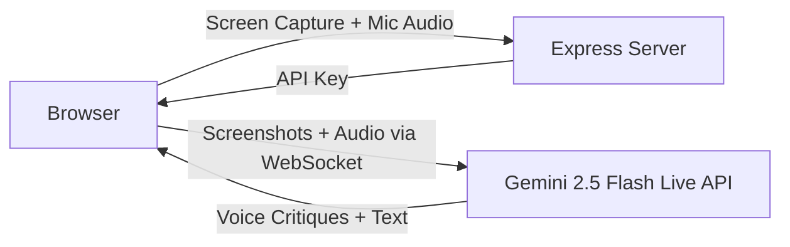

# Crumble: Real-Time AI UX Audit Tool


**Find the cracks before they crumble.**

---

## The Problem

Demos and product reviews often miss subtle UX issues — cluttered layouts, weak visual hierarchy, inaccessible contrast, confusing navigation. Getting expert UX feedback usually means booking a reviewer, waiting days, and paying hundreds per session. Most teams ship without it.

## The Solution

Crumble is a real-time AI design critic powered by **Gemini 2.5 Flash**. Share your screen, and it *watches* your UI live — analyzing screenshots every 2 seconds and speaking its critiques out loud like a senior UX reviewer sitting beside you. Ask follow-up questions naturally by voice. When the session ends, review transcripts, generate AI summaries, and export polished audit reports.

Unlike static analysis tools, Crumble is **conversational and multimodal** — it sees your screen, hears your voice, and responds in real-time through the Gemini Live API.

<!--
## Demo


> Watch the full demo: [YouTube Link](#)
-->

---

## Features

- **Real-Time Screen Analysis** — Periodic screenshots streamed to Gemini for continuous layout, typography, color, and accessibility critique
- **Voice Interaction** — AI speaks feedback aloud; interrupt anytime with your mic to ask questions or redirect focus
- **Expert-Level Prompting** — System prompt modeled after 15+ years of UX expertise (Apple, Stripe, Linear-caliber feedback)
- **Session History** — Past sessions persisted in localStorage with full transcript replay
- **AI Summaries** — One-click structured summary of all findings, prioritized by impact
- **HTML Report Export** — Download a styled, printable audit report to share with your team
- **Copy to Clipboard** — Instantly share findings in any chat or doc

---

## How It Works



1. **Start a session** — Crumble captures your screen and microphone
2. **Gemini analyzes live** — Frames sent every 2s + audio streamed via the Live API
3. **AI speaks its critique** — Layout, hierarchy, CTAs, accessibility, interaction feedback
4. **You interrupt anytime** — Ask follow-ups; it pauses, answers, then resumes
5. **Review & export** — Browse session history, generate summaries, download reports

---

## Quick Start

**Prerequisites:** Node.js 18+ and a [Gemini API key](https://aistudio.google.com/apikey)

```bash
git clone https://github.com/tirth8205/Granola-X-DeepMind-Hackathon.git
cd Granola-X-DeepMind-Hackathon
npm install
echo "GEMINI_API_KEY=your_key_here" > .env
npm start
```

Open [http://localhost:3000](http://localhost:3000) in Chrome or Edge, click **Start Session**, and share your screen.

**Docker:**
```bash
docker build -t crumble .
docker run -p 3000:3000 -e GEMINI_API_KEY=your_key_here crumble
```

For detailed instructions and troubleshooting, see the [Setup Guide](docs/setup-guide.md).

---

## Tech Stack

| Layer | Technology |
|-------|-----------|
| **Frontend** | Vanilla JS, HTML, CSS (zero build step) |
| **Backend** | Node.js + Express (static files + API key proxy) |
| **AI** | Google Gemini 2.5 Flash — Live API with native audio |
| **Audio** | Web Audio API + AudioWorklet (PCM16 capture & playback) |
| **Deployment** | Docker-ready |

---

## Who Is This For?

- **Indie developers** shipping without a design team
- **Startup founders** building MVPs who need a quick UX gut-check
- **Design students** learning UX principles through real-time critique
- **Frontend engineers** confident in code but less sure about design decisions
- **Agencies & QA teams** adding UX checks to their review process

---

## Project Structure

```
├── server.js              # Express server + /token endpoint
├── public/
│   ├── index.html         # Single-page app shell
│   ├── app.js             # Client logic (Gemini Live, capture, UI)
│   ├── audio-worklet.js   # AudioWorklet for mic PCM16 encoding
│   └── styles.css         # Design system (dark theme, orb animations)
├── docs/
│   ├── setup-guide.md     # Setup & troubleshooting guide
│   └── plans/             # Design documents
├── Dockerfile             # Production container
├── package.json
└── .env                   # Gemini API key (gitignored)
```

---

## Hackathon Context

Built for the **Granola x DeepMind Hackathon** (February 2026) — exploring creative applications of Google's Gemini API for multimodal, real-time interaction. Crumble demonstrates how Gemini's Live API can power conversational AI experiences that go beyond chat — turning passive screen-sharing into an interactive design review.

---

## License

MIT

## Credits

Built by **Tirth Kanani** using the [Gemini API](https://ai.google.dev/).
